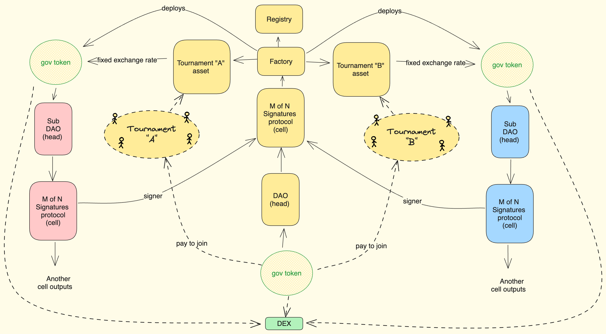

# Meritocratic Autonomous Organizations

Meritocratic Interoperable Autonomous Organization (MIAO) is an end game vision for Rankify Fellowships. By adding governance layer to the existing framework, it enables a new way of organising and governing organisations.

MIAOs are basically creating additional contract infrastructure on top of the existing fellowship instances, such as DAO and multisig contracts that actually execute and store value.

Core of the platform logic is written in Solidity and can be deployed on any EVM compatible chain.

1. **Distribution System**
      - Main protocol entry point to start new community
      - Based on [Ethereum Distribution System](https://github.com/peeramid-labs/eds)
      - Enables decentralized infrastructure deployment
      - Main distributor: [MAODistributor.sol](./src/MAODistributor.sol)

2. **Token System**
      - [RankToken](./src/tokens/RankToken.sol): ERC1155 token for rank representation
      - [DistributableGovernanceERC20](./src/tokens/DistributableGovernanceERC20.sol): ERC20 token for governance
      - [Rankify Token](./src/tokens/Rankify.sol): ERC20 token implementing entrance gating

3. **Diamond Pattern Implementation**
   - **Core Facets:**
     - EIP712InspectorFacet: EIP-712 message signing and verification
     - RankifyInstanceMainFacet: Tournament core logic
     - RankifyInstanceGameMastersFacet: Voting and proposal mechanics
     - RankifyInstanceRequirementsFacet: Participation requirements
     - DiamondLoupeFacet: Facet introspection
     - OwnershipFacet: Contract ownership management
