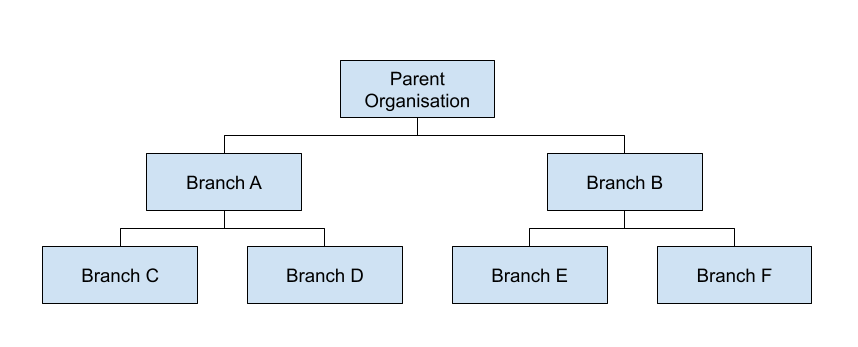
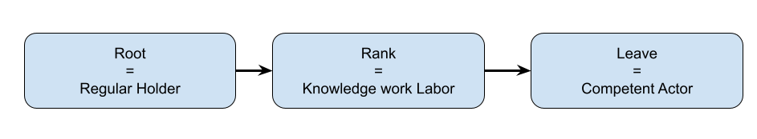
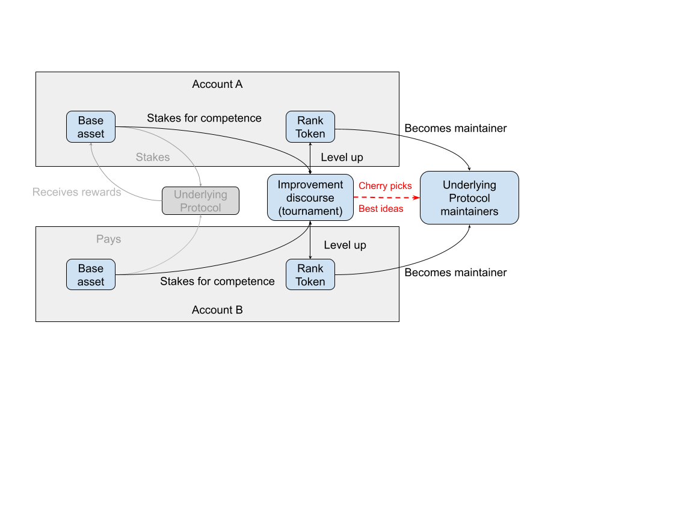

# Fellowships

Fellowships are a core building block that composes the Peeramid Network.
This building block is located in trie of trust enabling interoperability and mutual connectivity of organizations, defined as flow of control, where parent organization may channel its own utility or governance supply into sub-branches devoted to specific organizations.

## Progressive Decentralization

###  Fellowship Instances

Every trie node edge is represented by a Fellowship Instance: an intermediate state of participants transitioning their own weight from root into leaf. Fellows conviction is being tested out through the discussion with other members and at very minimum is constrained by time and base asset principal values.

### Fellowship Rank Token

Every connection between leaves can be represented as triple token system:

- **Root token:** Asset being converted into leave
- **Fellowship Rank token:** Asset that represents knowledge work recognition within peers going through the same process.
- **Leaf token:** Managerial body of the autonomous organization representing the underlying protocol.

 Core principle is that by design, rank token can only be obtained by consuming utility token and issuing ranks in accordance with proof of competence requirements.

Additionally, this flow of assets enables continuous deflation force on utility asset supply, producing instead inflation of skilled labour which is convertible into governance power within the organization.

## Use in established organizations
Fellowship instances can be created literally for any underlying protocol that is expressed in tokenized utility token.
By configuring how particular allocation of tokens happens, such fellowship creators can define retention time of community conducted discussion expressed in his asset form as well as can set up a treasury for future fellowship communities to manage.

