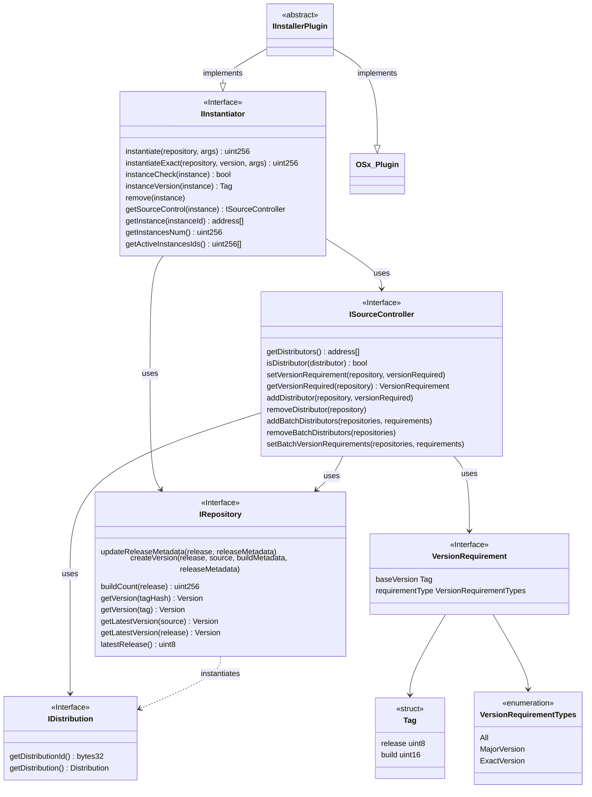
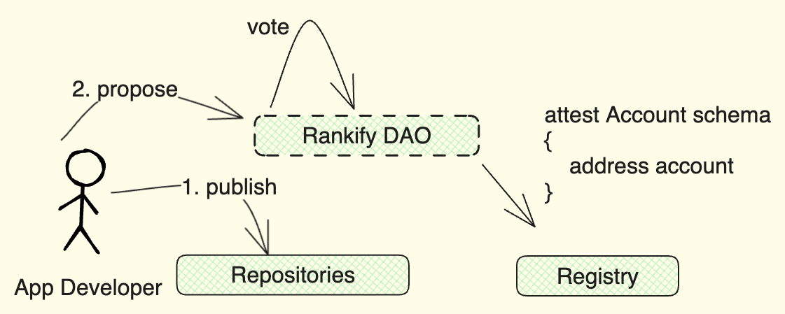
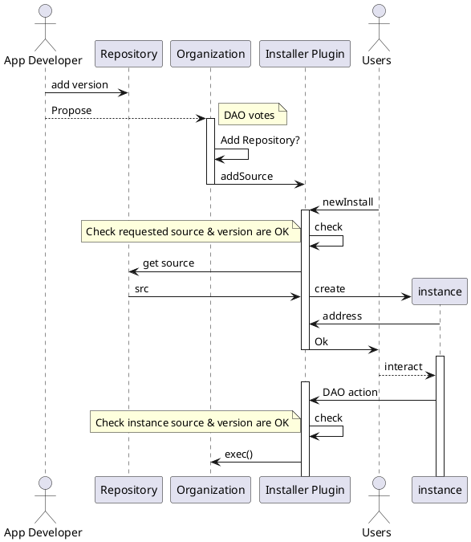
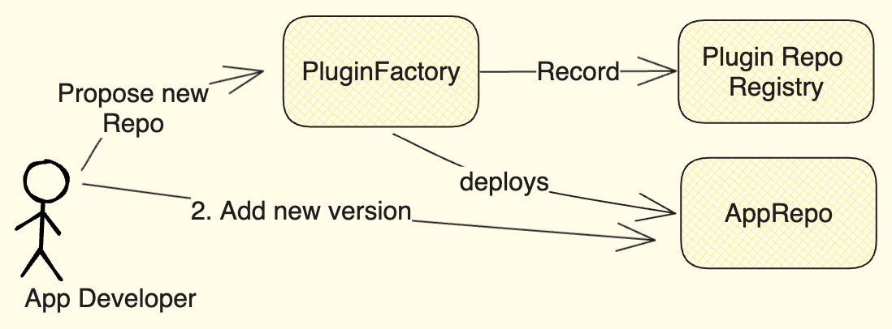
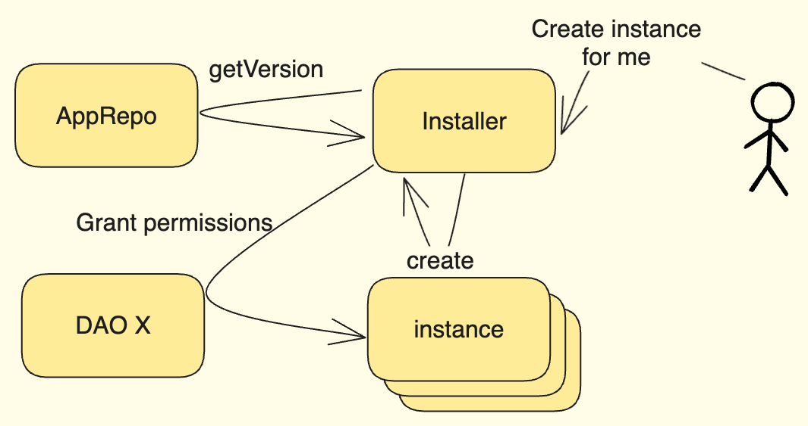
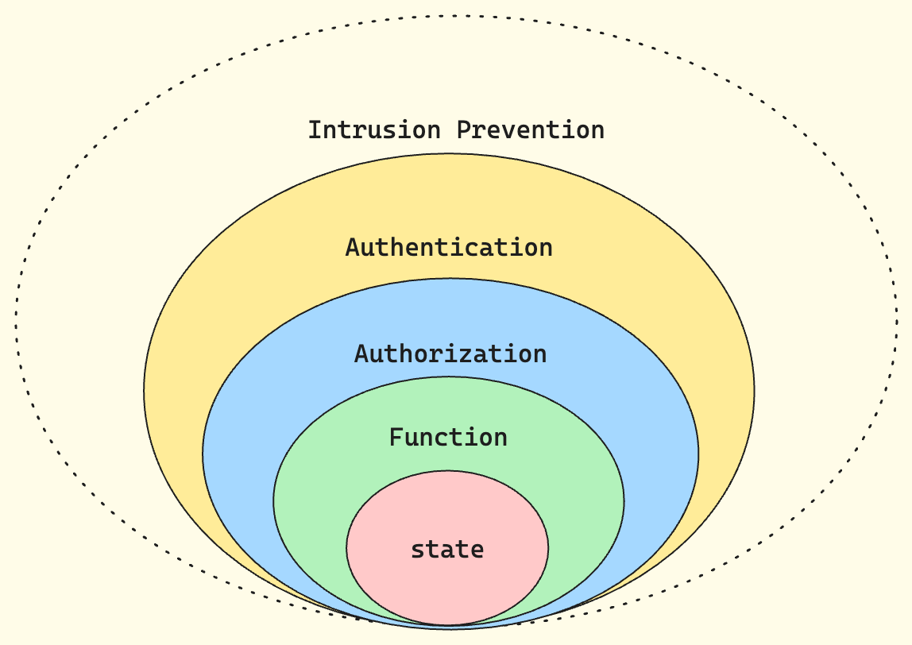

# Smart contract infrastructure

The Rankify smart contract infrastructure is built upon a modular design, emphasizing trustless operations to facilitate progressive decentralization within organizations and to mitigate some of the roadblocks on wider adoption of decentralized governance.

Adhering to systems theory principles, the architecture can be understood as a black box, responding to stimuli inputs with defined output reactions, while its key feature is the support for recursive patterns, enabling iterative processes on both input and output levels.

Including governing body, infrastructure as consisting of two main pieces:

-   **App Store**: Registry of different ranking system applications that may be installed on cells
-   **Cell infrastructures**: Dimensions for ranking that participants produce.


!!! note

    The rankify community governing DAO and multi-sig in the image above can be seen as an instance of _Cell_ infrastructure.

## Cells

A single cell is an autonomous governance unit, structured as an NxM matrix of inputs and outputs connected to a multisig-wallet. Each cell, representing a specific topic or workgroup, leverages a modular and customizable infrastructure consisting of:

-   **Rank NFT**: A semi-fungible ERC1155 token signifying the bearer's rank within the subject.
-   **Governance Token**: An ERC20 token used for governance, minted by exchanging Rank NFTs.
-   **DAO contract**: [OSx DAO Contract](https://devs.aragon.org/docs/osx/reference-guide/core/dao/) governed entirely by holders of the governance token.
-   **App Instance**: Ranking app, implements the autonomous competence identification protocol.
-   **Multisig Wallet**: A wallet adhering to the Gnosis [ISafe](https://github.com/safe-global/safe-smart-account/blob/main/contracts/interfaces/ISafe.sol), connecting governing bodies and facilitating decision-making.


Protocol is modular, loosely-coupled interfaces oriented and trends to support already existing multi-sig infrastructure, may easily incorporate DAOs built on other frameworks as well as experimentation. Cells may be distinguished in three categories based on origin: Factory deployed, established protocols that adapt technology, and modified experimentation structures, that are referred as _Primordial_, _Generated_, and _Mutated_ accordingly.

Above diagram describes infrastructure _Generated_ cells adhere, while diagram involving governing body (green blocks) on top of this page describes _primordial_ cell, which yet has no Rank NFT asset to complete it, as well as it is not listed in any auto-generation registries.

<!-- - **Primordial**: Existing multisig wallets incorporating logic of protocol without having support for immutable head
- **Complete**: Cells deployed in strict compliance with protocol
- **Mutated**: Cells that are intentionally modifying rankify protocol for sake of research and further development
  Initial cell input, also referred as "_head_" -->

## Ethereum Distribution System

The core concept of scaling Rankify is to give ability for organizations to easily spawn whole pieces of new infrastructure, such as new cells, or new applications that form organizations unique offerings to others in the network.

Such spawning should be as easy as possible, yet it should be secure and permission less and scale well.

Thus we develop a distribution system with goal to provide as generic and permission less approach as possible with yet a security guarantees between different organizations, that are translated trough curating own application infrastructure. Distribution system infrastructure consist of:

-   **[IInstallerPlugin](https://github.com/rankify-it/contracts/blob/main/src/abstracts/IInstallerPlugin.sol)**: Combines the abilities of (`IInstantiator`) and act as a plugin within the Aragon OSx framework (`Plugin`).
-   **[IDistributon](https://github.com/rankify-it/contracts/blob/main/src/interfaces/eds/IDistributon.sol)**: Manages and serves information about groups of source code (packages) from version-controlled repositories. It ensures these repositories comply with the `IRepository` interface.
-   **[IInstantiator](https://github.com/rankify-it/contracts/blob/main/src/interfaces/eds/IInstantiator.sol)**: Creates new instances of contracts using the `ISourceController` as an authority. It also acts as a registry for active instances and ensures version compatibility with the source controller.
-   **[IRepository](https://github.com/rankify-it/contracts/blob/main/src/interfaces/eds/IRepository.sol)**: Defines how source code repositories should be structured. It introduces `SourceTypes` to accommodate different ways of consuming source code.
-   **[ISourceController](https://github.com/rankify-it/contracts/blob/main/src/interfaces/eds/ISourceController.sol)**: The authoritative source for managing source code distribution. It works with repositories (`IRepository`) and defines rules for versioning and access.



App developer either deploys plain source or sets up a repository for his work and deploys his source to that to provide version control interface. Then he can propose any organization to add his repository to their Installer Plugin to have his application available for installation.
If it succeeds, organization members now can create their own instances of applications that will share same source code, version requirements and permissions to proxy calls on to the DAO contract.

<!-- -   **Distributor**: Combines sources with installation instruction into distribution. -->

<!-- {: style="height:auto;width:500px"} -->



<!-- ### Factory

The App Factory serves as a source for app installations, guaranteeing deterministic logic source in deployed applications. This enables the creation of interconnected ecosystems where trust is built on a shared understanding of app functionality. -->

<!--  -->

Anyone may create own repository and become distributor. Rankify DAO will curate its own distribution contract, listing its own resources and community-approved third-party applications.
[IVRepoFactory](https://github.com/rankify-it/contracts/blob/23-v09-factory-specifications/src/interfaces/IVRepoFactory.sol) is provided for convenience of creating new repositories.

### Repositories

The App Repositories are built upon the [IRepository](https://github.com/rankify-it/contracts/blob/23-v09-factory-specifications/src/interfaces/IRepository.sol) interface, which mirrors the functionality of the [OSx IPluginRepo](https://github.com/aragon/osx/blob/develop/packages/contracts/src/framework/plugin/repo/IPluginRepo.sol). It provides a versioned repository for source non-permissive control implementations.
Users of that repository can be sure that every time they request specific application version, same address will be returned and keep track of newest releases.

!!! Note

    Source code that is being versioned does not need to be aware of the repository structure, already existing contracts may be added to the repository.

### Installer

Installer is an `abstract` integration contract that takes distributions and installs them into target organization. It must implement [IInstaller]() interface, and it's only interface dependency is [Repository](index.md#repositories) contract. It is an abstract that must be extended to meet specific target interface requirements.

<!-- To maximize flexibility for both users and developers, we anticipate that applications installed within organizations will often require internal encapsulation.

{: style="height:auto;width:500px"}

In order to accommodate for that, Installer provides a way to instantiate multiple instances of the same application, each with its own unique configuration. This allows for a more modular and flexible system, where applications can be tailored to the specific needs of each organization. -->

!!! Note

     Application might have time-zone specific properties, making it necessary to have multiple instances of the same application, each with its own unique configuration.

!!! Warning

    Installer main use case assumes ability to instantiate multiple instances, it does not track permissions to install applications nor it enforces their count. Such limits can be introduced in the instantiation logic `InstallationPlan` requirements that are approved by DAO.

#### OSx Installer

A concrete installer version, "OSx Installer" plugin is provided to support integration with [Aragon OSx](https://aragon.org/aragonosx) framework. This Installer must be authorized by the DAO, maintains a list of approved distributors as well it is the only system component that must be aware of installation target specific interfaces. It simplifies the process for users to launch whitelisted applications, acting as a proxy between instances and the DAO contract as well as generalizes apps development.

<!-- ## Security

We aim to provide clear and encapsulated separation between functional components and security measures. This allows for a more modular and flexible system, where security can be tailored to the specific needs of each component without affecting functional requirements.

Defense-in-depth onion approach is used as described in [Smart contract layers](https://github.com/peersky/smart-contract-layers/tree/main), each secured functional component is encapsulated in a proxy that implements security measures.

{: style="height:auto;width:500px"}

Each call to any functional element, no matter is a view or non-view, is routed through a proxy that implements security measures. It receives full call data including sender, signature, call data and values, and can decide to allow or deny the call based on the security requirements. -->

<!-- ```puml
@startuml
scale 600 width
!theme carbon-gray
actor "User" as U
actor "Auditor" as A
participant "Factory" as F
participant "Audited Contract" as AC
participant "Bridge" as B
actor "Bridge Operator" as BO

A -> F: Register Auditor Signing Key
A -> U: sig(bytecode,calldata)
U -> F: deploy(bytecode,calldata,sig)
activate F
F <-> F: verify key
F -> AC: deploy
activate AC
F <- AC: address
deactivate AC
BO -> B: Register Trusted App Factory
F <-> F: register address
U <- F: address
deactivate F
U -> B: Register token with audit
activate B
B -> F: verify address (eip-1271)
activate F
F -> B: response
deactivate F
B <-> B: Activate token
B -> U: Response
deactivate B
U -> B: Bridge token -->

<!-- ``` -->

<!-- note left of U: This is a note. -->
