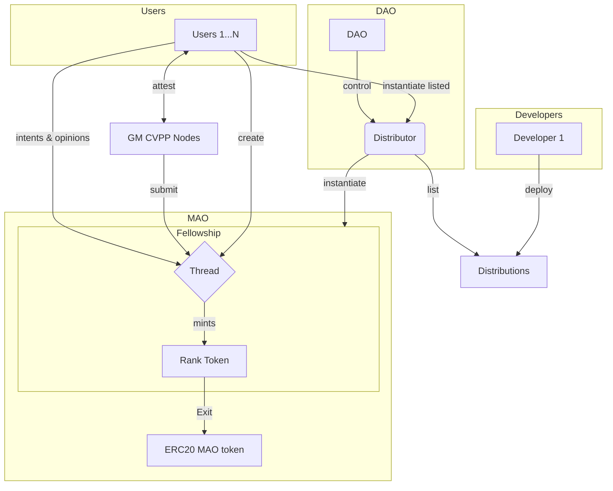

# Overview

Rankify is a platform for creating and participating in tokenized voting systems. Our platform is designed to be used by DAOs to create tokenized voting systems for their communities.

## Available Distributions

### 1. Meritocratic Autonomous Organization (MAO)

The MAO distribution ([MAODistribution.sol](./src/distributions/MAODistribution.sol)) creates a complete infrastructure for a Meritocratic Autonomous Organization, including:
- Rank and governance tokens
- Autonomous Competence Identification Distribution

### 2. ACID Distribution

The Autonomous Competence Identification Distribution ([ArguableVotingTournament.sol](./src/distributions/ArguableVotingTournament.sol)) implements:
- Turn-based game mechanics
- Voting and proposal systems
- EIP-712 compliant message signing
- Modular architecture

- **Game Master Nodes**: Trusted environment where voters can submit their opinions and intents.
- **Distributor**: A contract where fellowship templates are stored and instantiated.
- **Fellowship**: A smart contract representing a fellowship.
- **Rank Token**: A smart contract representing a rank token.

In a high level overview, Rankify architecture consists of game master nodes or servers who act as trusted environment where voters can submit their opinions and intents and the trusted server will ensure that these votes or opinions are indeed structured correctly according to the rules of the fellowship and will attest those. The participants later will submit those proposals or opinions to the on-chain contract which will facilitate all of the calculation of the scores and will act as trusted environment. Additionally, Staking and SCRO conditions are implemented, ensuring game theoretic alignment for the game master nodes to actually serve the service level agreements with their users.

