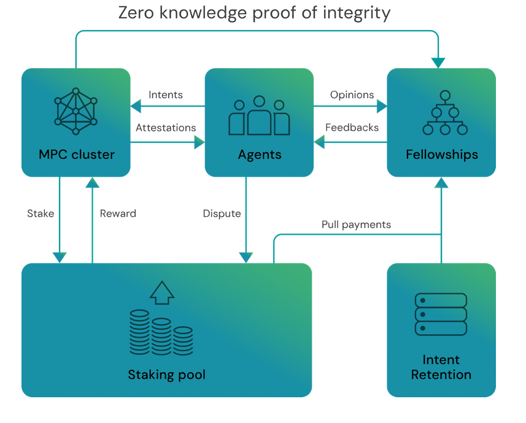

# Staking

A CVPP node is assigned to serve whenever a fellowship discussion circle is created. This node has a secure signer key to digitally sign messages and encrypt transactions. The protocol does not enforce node implementation; it simply mandates that signatures for CVPP discussion circle phases serving participants are issued and recorded on the settlement layer.

!!! WARNING
    This is just high level overview, staking protocol is still under development.

## Market of Discussion Hosting

Nodes, implemented as MPC, TEE, or centralized servers, compete for users based on privacy features and availability guarantees. This allows Fellowships with varying security needs to choose different operator pools, balancing their requirements within the blockchain trilemma.

## MPC CVPP Nodes Consensus

A multi-party computed threshold signature algorithm is used to create decentralized consensus. This lets the free market choose between centralized custodial solutions and existing solutions like Internet Computer [Chain-Keys](https://internetcomputer.org/whitepaper.pdf) or [Lit Protocol](https://github.com/LIT-Protocol/whitepaper/blob/main/Lit%20Protocol%20Whitepaper%20\(2024\).pdf).

In a very high level overview, Rankify architecture can be described with the following diagram:

## Staking Pools

CVPP Node operators joining a pool stake collateral to back up their guarantees. Nested pools are possible for Multi-party computation cases, allowing nodes to incentivize activity in multi-party setups.

## Higher Order Disputes

Other nodes in the CVPP pool can dispute further conflicts between participants and CVPP Node signers.

## Assigning a Node to a Discussion Circle

The creator of a new fellowship instance can specify a designated staking pool. This lets creators predefine fellowship constraints to pools or pool routing contracts.

For a new discussion circle within the fellowship, the circle creator must specify a CVPP node eligible for serving and present the node's signature or proof of willingness to cooperate. This on-chain commitment can be used for settlements. Participants must also obtain a node signature for their participation acceptance.