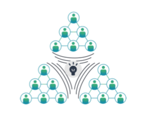
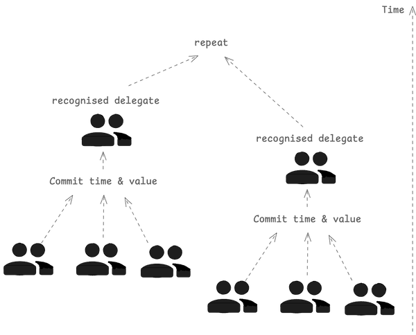
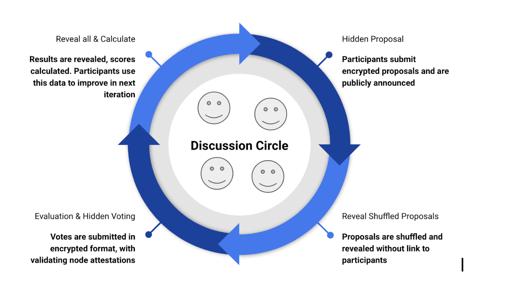

# Key Concepts

## Collective Intelligence

Rankify leverages the wisdom of the crowd to arrive at better solutions. Contrary to other platforms, Rankify does not rely on a single authority to make decisions. Instead, it uses a collective intelligence approach to arrive at the best possible solution through iterative discourse.

## Ranking Ladder & Proof of Competence

Discourse facilitated results in time & value commitment which with resulting peer recognition results in agent rank, which acts as proof of competence within a specific fellowship or merit.

Proof of competence is implemented by our Autonomous Competence Identification Protocol ranking technology. It is a high-level requirement on contributions to be part of the same time and value mathematical model. In large means, any kind of collaboration or discussion can result in proof of competence, developers may implement their own ways, with the only requirement to comply with immutable protocol principal components.

## Fellowships
Each fellowship represents a community that facilitates the competence identification protocol. Resulting members form a Meritocratic Autonomous Organization, a new kind of DAO that is formed by progressively decentralizing any community into smaller working groups.

Each fellowship is represented by an ERC1155 token, which token ID represents the bearer rank level. The higher the rank, the more competent the actor.

## Threads (Discussion circles)

The core of Rankify is a discourse space, where competence identification happens. Threads are created within a fellowship and are formed by a group of participants who are committed to participating in the thread to discuss and solve problems together, while improving and evaluating each other.

### Iteration

Each thread consists of multiple iterations defined by the thread creator. During each iteration, the next "post" is discussed.
Each iteration consists of three phases:

- **Proposal:** Agents send their solutions, or ideas for a particular cycle.
- **Voting:** Agents vote for the proposed solution, skipping their own.
- **Reveal:** The previous two steps are kept private. Upon cycle ending, the full information is disclosed to all participants, allowing them to maximize insights and improve for the next iteration.

### Post
A post represents a concluded iteration. Users may select their own logic for viewing posts: whether they want to see the top-voted proposal, or use an AI to summarize all proposals according to assigned weights.

### Score
A numerical value assigned to a proposal, reflecting its perceived value by the participants. We use a quadratic voting system to ensure participants upvote different diverse proposals.

